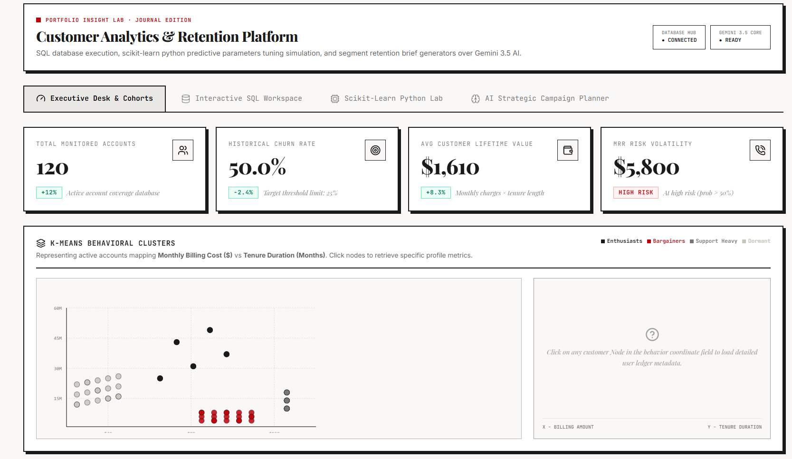
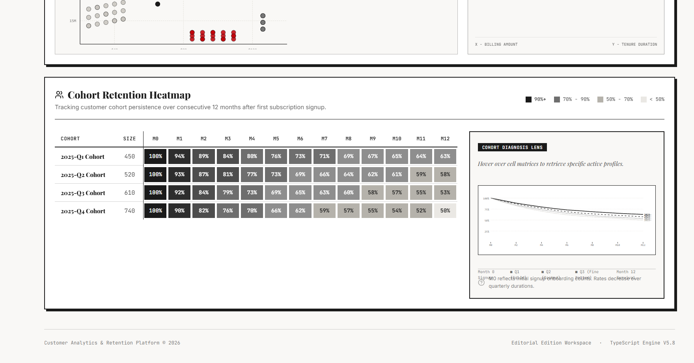

<div align="center">

📈 **CAR Platform — Customer Analytics & Retention Insights Platform**

Customer Analytics, Churn Prediction & Retention Intelligence using Python, SQL, Scikit-learn & Streamlit

An analytics-driven customer intelligence platform built to identify churn risks, segment customer behavior, perform retention analysis, and support targeted business strategies using SQL analytics, machine learning, and cohort intelligence.

</div>

<br>

<p align="center">
  
  
  
  
</p>

---

🚀 **Business Problem**

Organizations often struggle to understand:

✨ Why customers churn  

✨ Which customer groups are high-risk  

✨ How customer retention changes over time  

✨ Which customer segments require intervention  

✨ How to improve long-term customer lifetime value

Traditional customer analysis is often fragmented and reactive.

The **CAR Platform** solves this by combining **customer segmentation, churn prediction, cohort retention analysis, and behavioral intelligence** into a unified analytical system.

---

🎯 **Project Objectives**

✅ Predict customer churn risk  

✅ Identify high-risk customer segments  

✅ Perform cohort retention analysis  

✅ Analyze customer behavioral patterns  

✅ Support targeted retention strategies  

✅ Generate customer intelligence dashboards

---

🛠️ **Tech Stack**

| Technology | Purpose |
|------------|----------|
| Python | Analytics & ML logic |
| SQL | Data querying & transformation |
| Scikit-learn | Customer segmentation & prediction |
| Streamlit | Interactive analytics platform |
| Pandas | Data processing |
| K-Means Clustering | Customer segmentation |
| Cohort Analysis | Retention tracking |
| Gemini AI | Strategic retention brief generation |

---

📊 **Executive Dashboard & Customer Segmentation**

The executive dashboard provides a high-level overview of customer health and business retention metrics.

Key monitored indicators:

✨ Customer lifetime value (CLV)  

✨ Monthly recurring revenue risk  

✨ Churn probability indicators  

✨ Customer behavior segmentation  

✨ K-Means behavioral clustering

The platform groups customers into meaningful behavioral segments such as:

✅ Enthusiasts  

✅ Bargainers  

✅ Dormant Customers  

✅ Support Heavy Users

<br>

<p align="center">
  
</p>

---

🧠 **Customer Segmentation & Churn Intelligence**

Behavioral segmentation is powered using:

✨ K-Means Clustering  

✨ Customer billing analysis  

✨ Tenure-based segmentation  

✨ Behavioral grouping logic  

✨ Churn probability modeling

This helps identify:

✅ High-risk customers  

✅ Retention opportunities  

✅ Revenue risk exposure  

✅ Customer lifecycle patterns

---

📉 **Cohort Retention Analysis**

The platform includes cohort-based retention tracking to evaluate customer persistence over multiple months.

Capabilities include:

✨ Monthly cohort tracking  

✨ Retention decay analysis  

✨ Customer persistence monitoring  

✨ Trend comparison across cohorts

Business value:

✅ Detect churn acceleration early  

✅ Compare cohort health over time  

✅ Improve retention strategies  

✅ Understand customer lifecycle behavior

<br>

<p align="center">
  
</p>

---

📌 **Key Features**

✨ Customer Analytics Dashboard  

✨ Customer Churn Prediction  

✨ K-Means Behavioral Clustering  

✨ Cohort Retention Heatmaps  

✨ Customer Lifetime Value Monitoring  

✨ Revenue Risk Analysis  

✨ SQL-Based Customer Intelligence  

✨ Retention Insights Platform  

✨ AI Strategic Campaign Planning

---

📊 **Business Impact**

✅ Identified high-risk customer segments through behavioral analysis  

✅ Improved visibility into customer retention trends  

✅ Enabled proactive retention planning  

✅ Supported targeted customer engagement strategies  

✅ Reduced dependency on manual retention reviews

---

🧠 **ML & Analytics Concepts Used**

```python
K-Means Clustering
Customer Segmentation
Churn Prediction
Cohort Analysis
Retention Modeling
Customer Lifetime Value (CLV)
Behavioral Analytics
Trend Analysis
```

---

🧠 **SQL Concepts Used**

```sql
JOINS
GROUP BY
COMMON TABLE EXPRESSIONS (CTEs)
WINDOW FUNCTIONS
AGGREGATIONS
CASE WHEN
SUBQUERIES
PARTITION BY
ANALYTICAL QUERIES
```

---

📌 **Future Enhancements**

✨ Real-time customer event tracking  

✨ Automated churn alerts  

✨ Recommendation engine for retention offers  

✨ Advanced predictive retention models  

✨ Multi-channel engagement analytics

---

👩‍💻 **Author**

**Sankeerthana Verneni**

Aspiring Software Engineer • Data Analytics • SQL Engineering • AI/ML
